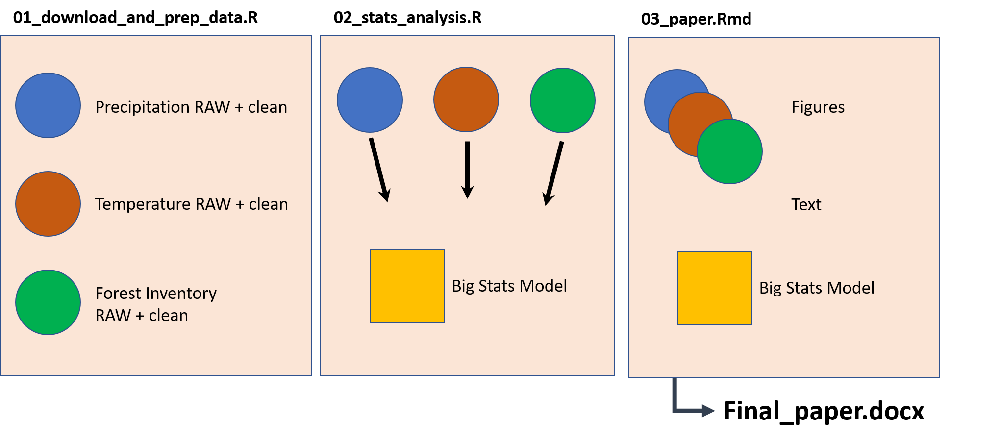
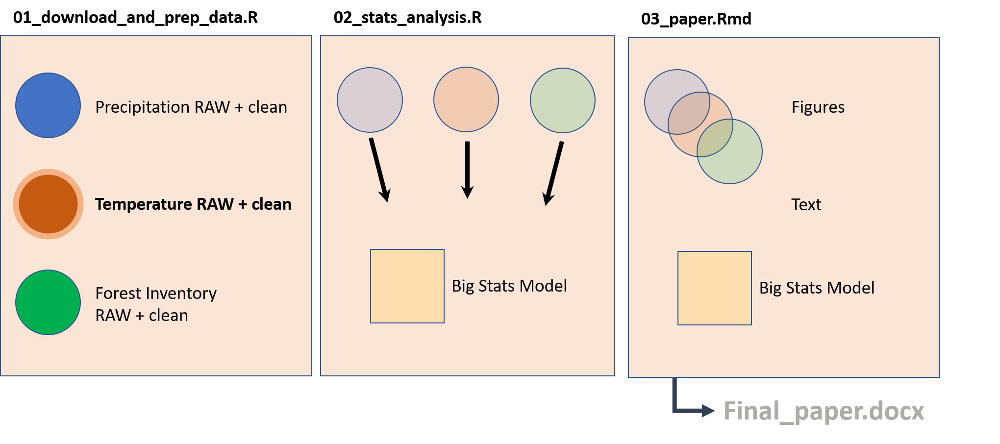

```{r setup, include=FALSE}
knitr::opts_chunk$set(echo = FALSE)
```

## Motivation {.smaller .build}

Often:

- Complex analyses
- many steps that depend on each other
- not sure which outputs were up to date
- calculations could benefit from parallel implementation / HPC

<div class="centered">

</div>

## Motivation {.smaller}

Often:

- Complex analyses
- many steps that depend on each other
- not sure which outputs were up to date
- calculations could benefit from parallel implementation / HPC

<div class = "centered">

</div>

## drake..


<!-- <font size="-1"> -->

<!-- > [`drake`] analyzes your workflow, skips steps with up-to-date results, and orchestrates the rest with optional distributed computing. At the end, drake provides evidence that your results match the underlying code and data, which increases your ability to trust your research. -->

<!-- </font> -->

- lets you structure your workflow into individual steps
- analyzes your workflow
- skips steps with up-to-date results
- orchestrates everything with optional distributed computing (HPC, parallel, etc.)

<div class="centered">

</div>

## drake.. {.build}

<br>
<br>

Has extensive documentation (follow [link](https://books.ropensci.org/drake/))

<br>
<br>

Is being superseded by `targets` (follow [link](https://docs.ropensci.org/targets/))

## Getting started

```{r eval=FALSE, echo=TRUE}
drake::drake_example() # generates working project

drake::use_drake()
```

$\uparrow$ Provides a useful template with folders and files..

.. and assumes a *functional programming* paradigm.

<br>

**All analyses steps are functions.**

- can be tested against expected outputs
- can be debugged (!!!)
- can be applied with various parameters (for parallel computing)


## Good to know: 

## Good to know: Files and Folders {.smaller .build}


- `packages.R`: libraries used during analyses  
$\rightarrow$ keep adding
- `functions.R`: functions used during analyses   
$\rightarrow$ keep building and testing
- `plan.R`: executes functions (*targets*) and manages dependencies  
$\rightarrow$  extensive adjustment with targets, see [here](https://books.ropensci.org/drake/plans.html)
- `make.R` / `_drake.R`: controls execution  
$\rightarrow$ rarely need to touch

```{r echo = TRUE, eval = FALSE}

plan <- drake::drake_plan(
    
    downloaded_data = get_data(),
    
    cleaned_data = clean_data(downloaded_data),
    
    models = run_stat_model(cleaned_data),
    
    overview_figure = make_figure(cleaned_data,
                                  models))


```


## Good to know: Files and Folders {.smaller .build}

<font size="+1">
**Existing scripts can be converted**:  
`drake::code_to_function()`     
</font>

```
01_get_data.R
02_clean_data.R
03_run_models.R
```

.. are converted into custom functions for use in `plan.R`.  
.. but this is *not recommended for starting new projects*

## Good to know: {.smaller .build}

## Good to know: Executing {.smaller .build}

 
**Run!**  

- `drake::make()` $\rightarrow$ on servers  
- `drake::r_make()` $\rightarrow$ in interactive `R` sessions  


**Check!**  

- `drake::outdated()`  
$\rightarrow$ show outdated dependencies   

- `drake::vis_drake_graph()`   
$\rightarrow$ show interactive dependency   graph    

- `drake::loadd()`, `drake::readd()`  
$\rightarrow$ load plan targets into curren `R` session env.


**Manage!**  

- `drake::file_in()`, `file_out()`, `knitr_in()`   
$\rightarrow$ for `drake` to track dependencies of external files 

## Questions?


## Live demo


